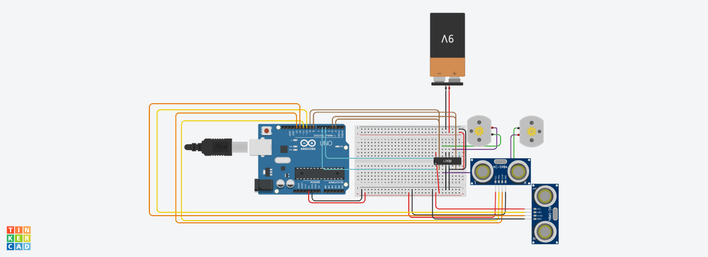

# InteligentCar_WallFollwer

For my physic first year project I decided to build a autonomus car that follow the perimeter of the wall on the right.
 

## Circuit Diagram

[Tinkercad](https://github.com/un0038998/PS3ControlledCar/blob/main/Diagrams/PS3%20Controlled%20Car.png)

 

## Components

- Arduino Uno (x1)

- L293D (x1)

- Distance Sensor (x2)

- Motors with GearBox (x2)

- 9V battery (x2)

- Bradboard (x1)

- Switch off/on (x1)

- Wires male to male

- Wires male to female

- Giroscopic wheel

- Solid plastic easy to cut for structure 
 

## Controll

It uses two distance sensor, one on the front one on the right side, to detect his position in comparison to the wall. Using a Truth table I set down all th cases possible:

FOR RIGHT SIDE
- ToCloseWall

- ToFarWall

- Correct

FOR FRONT
- WallInFront

- NoWallInFront

This 6 cases are reflected in the code.

L298N (Speed control, DC motor voltage 5-35V, Direction control, Peak current 2A), connect to 2 motors with wheels. The L298N is connected to the arduino and gets information from the distance sensors

 

## Evaluation

The car don't miss!! Almost never tuches the wall. The problem and possible improve can be a better way to power the car